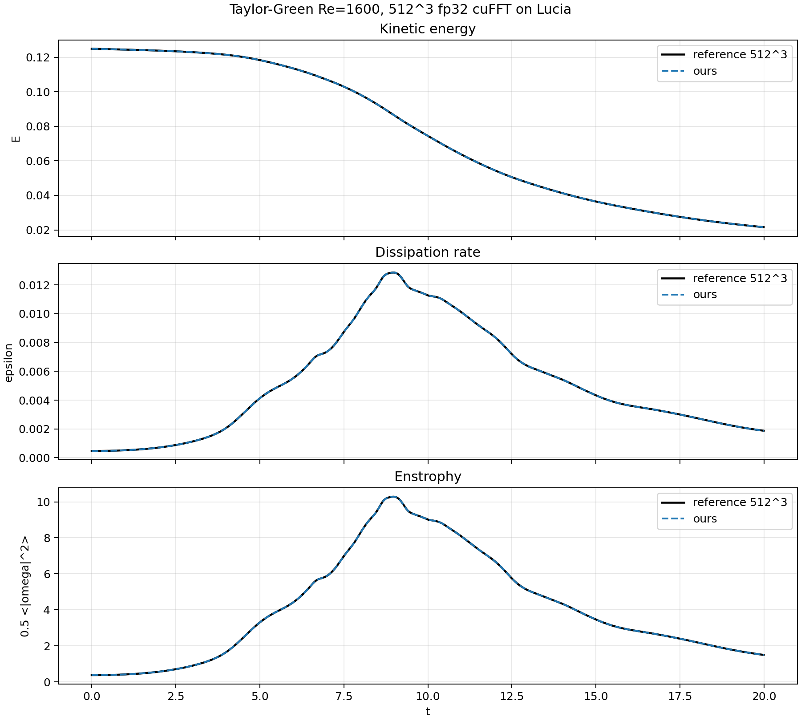

# Taylor-Green Benchmark Rerun

Date: 2026-06-19

Fresh full-run parameters for all completed rows:

```text
--re 1600 --adaptive-cfl 1 --dt 0.5 --cfl 0.5 --t-end 20 --output-dt 1 --print-every 20
```

Completed laptop and `bobby` rows were rebuilt in `Release` from the current working tree. `lucia` rows include completed Slurm jobs. Float32 rows are single-GPU cuFFT comparisons. Precision is reported as `64` for float64 and `32` for float32.

## 512^3 Reference Comparison

Lucia job `14463129` reran the 512^3 AVA(CUDA)+cuFFT precision-32 case with `output_dt=0.01`, matching the cadence of `spectral_Re1600_512.dat`. The plot compares kinetic energy, dissipation rate, and enstrophy against the reference.



## Machine Hardware

| machine | CPU | CPU topology | GPU |
| --- | --- | --- | --- |
| laptop | 12th Gen Intel Core i9-12900H | 20 logical CPUs, 14 cores, 2 threads/core, 1 socket | NVIDIA RTX A2000 8GB Laptop GPU, 8192 MiB, driver 595.80 |
| bobby | 13th Gen Intel Core i5-13500 | 20 logical CPUs, 14 cores, 2 threads/core, 1 socket | NVIDIA RTX A4000, 16376 MiB, driver 590.48.01 |
| lucia | GPU nodes `cna049`/`cna050`: Slurm reports 32 CPU cores, 1 socket, 1 thread/core, 245760 MiB RAM per node | Jobs in this report used either 1 GPU + 8 CPU cores, or 4 GPUs + 8 CPU cores total for cuFFTMp | 4x NVIDIA A100-SXM4-40GB per GPU node |
| meluxina | GPU node `mel2039`: Slurm allocated 128 CPUs and 480G RAM for the completed exclusive-node job | Job in this report used 4 MPI ranks and 4 A100 GPUs | 4x NVIDIA A100-SXM4-40GB per GPU node, driver 595.71.05 |

## Timing Overview

Compact table for quick reading. Timings are rounded to 0.1 s; distributed rows use max-over-ranks. `mpi_ranks` is the number of MPI ranks, not the allocated CPU core count.
| machine | grid | path | precision | mpi_ranks | gpus | wall_s | run_s | rhs_s | fft_fwd_s | fft_bwd_s | steps |
| --- | --- | --- | --- | --- | --- | --- | --- | --- | --- | --- | --- |
| laptop | 64^3 | AVA(CPU)+FFTW | 64 | 1 | 0 | 69.5 | 69.2 | 59.0 | 20.3 | 12.8 | 352 |
| laptop | 64^3 | AVA(CPU)+FLUPS(CPU) | 64 | 1 | 0 | 180.7 | 176.9 | 163.5 | 96.0 | 55.7 | 352 |
| laptop | 64^3 | AVA(CPU)+FLUPS(CPU) | 64 | 2 | 0 | 97.8 | 94.1 | 87.0 | 50.2 | 29.8 | 352 |
| laptop | 64^3 | AVA(CPU)+FLUPS(CPU) | 64 | 4 | 0 | 53.1 | 49.4 | 45.7 | 25.6 | 15.2 | 352 |
| laptop | 64^3 | AVA(CPU)+FLUPS(CPU) | 64 | 8 | 0 | 49.9 | 46.1 | 42.7 | 25.0 | 15.2 | 352 |
| laptop | 64^3 | AVA(CUDA)+cuFFT | 32 | 1 | 1 | 5.5 | 3.1 | 2.7 | 0.8 | 0.5 | 352 |
| laptop | 64^3 | AVA(CUDA)+cuFFT | 64 | 1 | 1 | 13.2 | 11.1 | 10.0 | 4.7 | 3.1 | 352 |
| laptop | 128^3 | AVA(CUDA)+cuFFT | 32 | 1 | 1 | 56.7 | 56.0 | 49.2 | 16.6 | 11.9 | 740 |
| laptop | 128^3 | AVA(CUDA)+cuFFT | 64 | 1 | 1 | 232.2 | 231.3 | 211.2 | 109.7 | 69.5 | 740 |
| bobby | 64^3 | AVA(CPU)+FFTW | 64 | 1 | 0 | 39.6 | 39.6 | 35.5 | 14.5 | 10.2 | 352 |
| bobby | 64^3 | AVA(CPU)+FLUPS(CPU) | 64 | 1 | 0 | 134.2 | 133.4 | 124.8 | 76.8 | 44.6 | 352 |
| bobby | 64^3 | AVA(CPU)+FLUPS(CPU) | 64 | 2 | 0 | 73.8 | 73.0 | 68.3 | 40.5 | 23.7 | 352 |
| bobby | 64^3 | AVA(CPU)+FLUPS(CPU) | 64 | 4 | 0 | 39.8 | 38.9 | 36.5 | 20.1 | 12.0 | 352 |
| bobby | 64^3 | AVA(CPU)+FLUPS(CPU) | 64 | 8 | 0 | 37.6 | 36.8 | 34.5 | 20.0 | 11.7 | 352 |
| bobby | 64^3 | AVA(CUDA)+cuFFT | 32 | 1 | 1 | 1.7 | 1.2 | 1.1 | 0.3 | 0.2 | 352 |
| bobby | 64^3 | AVA(CUDA)+cuFFT | 64 | 1 | 1 | 4.6 | 4.1 | 3.7 | 1.7 | 1.1 | 352 |
| bobby | 128^3 | AVA(CUDA)+cuFFT | 32 | 1 | 1 | 24.4 | 24.0 | 21.1 | 7.1 | 5.1 | 740 |
| bobby | 128^3 | AVA(CUDA)+cuFFT | 64 | 1 | 1 | 75.2 | 74.8 | 67.6 | 31.8 | 20.5 | 740 |
| bobby | 256^3 | AVA(CUDA)+cuFFT | 32 | 1 | 1 | 388.4 | 387.5 | 340.3 | 113.9 | 81.7 | 1528 |
| lucia | 64^3 | AVA(CUDA)+cuFFT | 32 | 1 | 1 | 2.1 | 0.8 | 0.7 | 0.3 | 0.2 | 352 |
| lucia | 64^3 | AVA(CUDA)+cuFFT | 64 | 1 | 1 | 2.0 | 1.2 | 1.0 | 0.4 | 0.3 | 352 |
| lucia | 64^3 | AVA(CUDA)+FLUPS(CUDA) | 64 | 4 | 4 | 239.7 | 235.4 | 220.6 | 140.9 | 83.6 | 352 |
| lucia | 64^3 | AVA(CUDA)+cuFFTMp | 64 | 4 | 4 | 25.6 | 5.2 | 4.8 | 0.7 | 0.4 | 352 |
| lucia | 128^3 | AVA(CUDA)+cuFFT | 32 | 1 | 1 | 7.5 | 6.5 | 5.7 | 1.7 | 1.1 | 740 |
| lucia | 128^3 | AVA(CUDA)+cuFFT | 64 | 1 | 1 | 14.6 | 13.7 | 12.0 | 4.0 | 2.8 | 740 |
| lucia | 128^3 | AVA(CUDA)+FLUPS(CUDA) | 64 | 4 | 4 | 552.9 | 548.8 | 516.0 | 329.1 | 193.5 | 740 |
| lucia | 128^3 | AVA(CUDA)+cuFFTMp | 64 | 4 | 4 | 36.1 | 15.1 | 14.0 | 2.9 | 1.7 | 740 |
| lucia | 256^3 | AVA(CUDA)+cuFFT | 32 | 1 | 1 | 117.8 | 116.2 | 102.4 | 35.2 | 24.9 | 1528 |
| lucia | 256^3 | AVA(CUDA)+cuFFT | 64 | 1 | 1 | 223.1 | 221.5 | 195.2 | 67.6 | 48.0 | 1527 |
| lucia | 512^3 | AVA(CUDA)+cuFFT | 32 | 1 | 1 | 1822.1 | 1816.8 | 1599.9 | 544.0 | 384.2 | 3070 |
| meluxina | 64^3 | AVA(CUDA)+FLUPS(CUDA) | 64 | 4 | 4 | 41.7 | 14.1 | 12.7 | 8.3 | 5.2 | 352 |
| meluxina | 128^3 | AVA(CUDA)+FLUPS(CUDA) | 64 | 4 | 4 | 64.8 | 40.4 | 38.1 | 24.1 | 14.8 | 740 |
| meluxina | 256^3 | AVA(CUDA)+cuFFTMp | 32 | 4 | 4 | 84.8 | 70.8 | 64.9 | 16.0 | 9.1 | 1528 |
| meluxina | 512^3 | AVA(CUDA)+cuFFTMp | 32 | 4 | 4 | 778.9 | 761.8 | 687.3 | 203.7 | 118.7 | 3070 |

## Notes

Meluxina AVA(CUDA)+cuFFTMp precision-32 rows were collected from jobs `4736750` for 256^3 and `4736673` for 512^3. Job `4736750` requested `ReqTRES=cpu=8,gres/gpu=4` with 4 MPI ranks and `cpus-per-task=2`; Slurm allocated the full exclusive node. The previous 256^3 job `4736631` had similar timing (`wall=85.9s`, `run=73.1s`, `rhs=67.1s`). Earlier job `4736615` failed before configure because the cuFFTMp include path used `include/cufftmp/cufftMp.h`, while Meluxina's NVHPC 25.3 install provides `include/cufftMp.h`.

## Build And Run Notes

### Laptop / Nix

Configure and build the local paths:

```bash
nix develop -c cmake -S . -B build-bench-cpu-fftw -DAVA_TARGET=CPU -DSPECTRAL_FFT_BACKEND=FFTW -DSPECTRAL_PRECISION=DOUBLE -DCMAKE_BUILD_TYPE=Release
nix develop -c cmake --build build-bench-cpu-fftw --target taylor_green -j 8

nix develop -c cmake -S . -B build-bench-cpu-flups -DAVA_TARGET=CPU -DSPECTRAL_FFT_BACKEND=FLUPS -DSPECTRAL_PRECISION=DOUBLE -DCMAKE_BUILD_TYPE=Release
nix develop -c cmake --build build-bench-cpu-flups --target taylor_green -j 8

nix develop -c cmake -S . -B build-bench-cuda-cufft -DAVA_TARGET=CUDA -DSPECTRAL_FFT_BACKEND=CUFFT -DSPECTRAL_PRECISION=DOUBLE -DCMAKE_BUILD_TYPE=Release -DCMAKE_CUDA_ARCHITECTURES=86
nix develop -c cmake --build build-bench-cuda-cufft --target taylor_green -j 8
```

Run the full local sweep:

```bash
nix develop -c ./scripts/run_local_benchmark_sweep.sh /tmp/spectral_benchmark_sweep_local_YYYYMMDD
```

The runner executes the 64^3 FFTW baseline, FLUPS at 1/2/4/8 ranks, cuFFT at 64^3, and cuFFT at 128^3.

### Bobby / Debian

Sync source from the laptop:

```bash
rsync -a CMakeLists.txt src cmake scripts cpp_tests bobby:~/
```

Configure and build with explicit Debian HDF5 paths:

```bash
ssh bobby 'cd ~ && cmake -S . -B build-bench-cpu-fftw -DAVA_TARGET=CPU -DSPECTRAL_FFT_BACKEND=FFTW -DSPECTRAL_PRECISION=DOUBLE -DCMAKE_BUILD_TYPE=Release -DHDF5_INCLUDE_DIR=/usr/include/hdf5/openmpi -DHDF5_LIBRARY=/usr/lib/x86_64-linux-gnu/hdf5/openmpi/libhdf5.so'
ssh bobby 'cd ~ && cmake --build build-bench-cpu-fftw --target taylor_green -j 8'

ssh bobby 'cd ~ && cmake -S . -B build-bench-cpu-flups -DAVA_TARGET=CPU -DSPECTRAL_FFT_BACKEND=FLUPS -DSPECTRAL_PRECISION=DOUBLE -DCMAKE_BUILD_TYPE=Release -DHDF5_INCLUDE_DIR=/usr/include/hdf5/openmpi -DHDF5_LIBRARY=/usr/lib/x86_64-linux-gnu/hdf5/openmpi/libhdf5.so'
ssh bobby 'cd ~ && cmake --build build-bench-cpu-flups --target taylor_green -j 8'

ssh bobby 'cd ~ && PATH=/usr/local/cuda/bin:$PATH CUDAToolkit_ROOT=/usr/local/cuda cmake -S . -B build-bench-cuda-cufft -DAVA_TARGET=CUDA -DSPECTRAL_FFT_BACKEND=CUFFT -DSPECTRAL_PRECISION=DOUBLE -DCMAKE_BUILD_TYPE=Release -DCMAKE_CUDA_COMPILER=/usr/local/cuda/bin/nvcc -DCMAKE_CUDA_ARCHITECTURES=86 -DHDF5_INCLUDE_DIR=/usr/include/hdf5/openmpi -DHDF5_LIBRARY=/usr/lib/x86_64-linux-gnu/hdf5/openmpi/libhdf5.so'
ssh bobby 'cd ~ && PATH=/usr/local/cuda/bin:$PATH cmake --build build-bench-cuda-cufft --target taylor_green -j 8'
```

Run the `bobby` sweep:

```bash
ssh bobby 'cd ~ && ./scripts/run_local_benchmark_sweep.sh /tmp/spectral_benchmark_sweep_bobby_YYYYMMDD'
rsync -a bobby:/tmp/spectral_benchmark_sweep_bobby_YYYYMMDD /tmp/
```

### Lucia / Slurm

Sync source:

```bash
rsync -a CMakeLists.txt src cmake scripts cpp_tests lucia:~/spectral/
```

Submit the single-GPU cuFFT jobs:

```bash
ssh lucia 'cd ~/spectral && sbatch --export=ALL,SPECTRAL_GRID_SIZE=64 scripts/lucia_single_gpu_cufft.sbatch'
ssh lucia 'cd ~/spectral && sbatch --export=ALL,SPECTRAL_GRID_SIZE=128 scripts/lucia_single_gpu_cufft.sbatch'
ssh lucia 'cd ~/spectral && sbatch scripts/lucia_single_gpu_cufft_256.sbatch'
```

Submit the single-node cuFFTMp jobs:

```bash
ssh lucia 'cd ~/spectral && sbatch --export=ALL,SPECTRAL_GRID_SIZE=64 scripts/lucia_single_node_cufftmp_64.sbatch'
ssh lucia 'cd ~/spectral && sbatch --export=ALL,SPECTRAL_GRID_SIZE=128 scripts/lucia_single_node_cufftmp_64.sbatch'
```

Monitor the submitted jobs:

```bash
ssh lucia 'squeue -u jonathan -p debug-gpu -o "%.18i %.9P %.20j %.8u %.2t %.10M %.6D %R"'
```

Each Slurm script configures and builds in `Release` inside the job, runs the full benchmark parameters, writes a `.time` file with external wall time, and writes the solver profile output into the corresponding `.log` file under `~/spectral/out/`.

### Float32 single-GPU cuFFT

Use `-DSPECTRAL_PRECISION=SINGLE` for CMake builds, or set `SPECTRAL_PRECISION=SINGLE` when submitting the lucia single-GPU Slurm scripts.

```bash
nix develop -c cmake -S . -B build-bench-cuda-cufft-float -DAVA_TARGET=CUDA -DSPECTRAL_FFT_BACKEND=CUFFT -DSPECTRAL_PRECISION=SINGLE -DCMAKE_BUILD_TYPE=Release -DCMAKE_CUDA_ARCHITECTURES=86
ssh lucia 'cd ~/spectral && sbatch --export=ALL,SPECTRAL_GRID_SIZE=128,SPECTRAL_PRECISION=SINGLE scripts/lucia_single_gpu_cufft.sbatch'
```

## Detailed Timing Records

Same data as the full timing table, reformatted as one narrow record per run for PDF export. Timings are seconds; distributed rows report max over ranks.

### laptop / 64^3 / AVA(CPU)+FFTW / p64 / MPI 1 / GPU 0

- status: 0; scope: single_rank; wall_s: 69.5
- solver: init=0.0; run=69.2; step=66.2; rhs=59.0; diagnostics=0.5; max_velocity_time=2.6
- calls: step=352; rhs=1056; diagnostics=21; max_velocity=352
- rhs breakdown: velocity_backward=6.7; phase_shift=1.8; shift_backward=6.9; product_kernel=4.1
- rhs breakdown continued: product_forward=20.3; accumulate=13.3; viscous_project=5.9
- RK: update=3.3; project=3.9
- FFT: forward=20.3; backward=12.8; forward_calls=12675; backward_calls=7518
- cuFFTMp descriptor/copy: descriptor_alloc=n/a; descriptor_free=n/a; copy_in=n/a; copy_out=n/a
- output: /tmp/spectral_benchmark_sweep_local_20260619_r2/cpu_fftw_64

### laptop / 64^3 / AVA(CPU)+FLUPS(CPU) / p64 / MPI 1 / GPU 0

- status: 0; scope: max_rank; wall_s: 180.7
- solver: init=0.4; run=176.9; step=167.1; rhs=163.5; diagnostics=1.1; max_velocity_time=8.7
- calls: step=352; rhs=1056; diagnostics=21; max_velocity=352
- rhs breakdown: velocity_backward=24.6; phase_shift=1.0; shift_backward=23.8; product_kernel=4.7
- rhs breakdown continued: product_forward=100.4; accumulate=6.0; viscous_project=3.0
- RK: update=1.7; project=1.9
- FFT: forward=96.0; backward=55.7; forward_calls=12675; backward_calls=7518
- cuFFTMp descriptor/copy: descriptor_alloc=0.0; descriptor_free=0.0; copy_in=0.0; copy_out=0.0
- output: /tmp/spectral_benchmark_sweep_local_20260619_r2/cpu_flups_np1_64

### laptop / 64^3 / AVA(CPU)+FLUPS(CPU) / p64 / MPI 2 / GPU 0

- status: 0; scope: max_rank; wall_s: 97.8
- solver: init=0.4; run=94.1; step=89.0; rhs=87.0; diagnostics=0.6; max_velocity_time=4.8
- calls: step=352; rhs=1056; diagnostics=21; max_velocity=352
- rhs breakdown: velocity_backward=13.4; phase_shift=0.7; shift_backward=12.4; product_kernel=3.6
- rhs breakdown continued: product_forward=52.4; accumulate=3.3; viscous_project=1.8
- RK: update=0.9; project=1.2
- FFT: forward=50.2; backward=29.8; forward_calls=12675; backward_calls=7518
- cuFFTMp descriptor/copy: descriptor_alloc=0.0; descriptor_free=0.0; copy_in=0.0; copy_out=0.0
- output: /tmp/spectral_benchmark_sweep_local_20260619_r2/cpu_flups_np2_64

### laptop / 64^3 / AVA(CPU)+FLUPS(CPU) / p64 / MPI 4 / GPU 0

- status: 0; scope: max_rank; wall_s: 53.1
- solver: init=0.4; run=49.4; step=46.7; rhs=45.7; diagnostics=0.3; max_velocity_time=2.5
- calls: step=352; rhs=1056; diagnostics=21; max_velocity=352
- rhs breakdown: velocity_backward=6.9; phase_shift=0.6; shift_backward=6.3; product_kernel=3.1
- rhs breakdown continued: product_forward=26.7; accumulate=1.9; viscous_project=1.0
- RK: update=0.5; project=0.7
- FFT: forward=25.6; backward=15.2; forward_calls=12675; backward_calls=7518
- cuFFTMp descriptor/copy: descriptor_alloc=0.0; descriptor_free=0.0; copy_in=0.0; copy_out=0.0
- output: /tmp/spectral_benchmark_sweep_local_20260619_r2/cpu_flups_np4_64

### laptop / 64^3 / AVA(CPU)+FLUPS(CPU) / p64 / MPI 8 / GPU 0

- status: 0; scope: max_rank; wall_s: 49.9
- solver: init=0.4; run=46.1; step=43.7; rhs=42.7; diagnostics=0.3; max_velocity_time=2.6
- calls: step=352; rhs=1056; diagnostics=21; max_velocity=352
- rhs breakdown: velocity_backward=6.8; phase_shift=0.5; shift_backward=6.3; product_kernel=2.4
- rhs breakdown continued: product_forward=25.7; accumulate=2.3; viscous_project=0.7
- RK: update=0.6; project=0.6
- FFT: forward=25.0; backward=15.2; forward_calls=12675; backward_calls=7518
- cuFFTMp descriptor/copy: descriptor_alloc=0.0; descriptor_free=0.0; copy_in=0.0; copy_out=0.0
- output: /tmp/spectral_benchmark_sweep_local_20260619_r2/cpu_flups_np8_64

### laptop / 64^3 / AVA(CUDA)+cuFFT / p32 / MPI 1 / GPU 1

- status: 0; scope: single_rank; wall_s: 5.5
- solver: init=2.1; run=3.1; step=2.9; rhs=2.7; diagnostics=0.0; max_velocity_time=0.1
- calls: step=352; rhs=1056; diagnostics=21; max_velocity=352
- rhs breakdown: velocity_backward=0.2; phase_shift=0.2; shift_backward=0.2; product_kernel=0.5
- rhs breakdown continued: product_forward=0.8; accumulate=0.7; viscous_project=0.1
- RK: update=0.2; project=0.1
- FFT: forward=0.8; backward=0.5; forward_calls=12675; backward_calls=7518
- cuFFTMp descriptor/copy: descriptor_alloc=n/a; descriptor_free=n/a; copy_in=n/a; copy_out=n/a
- output: /tmp/spectral_benchmark_single_gpu_float32_local_20260619_r3/cuda_cufft_float32_64

### laptop / 64^3 / AVA(CUDA)+cuFFT / p64 / MPI 1 / GPU 1

- status: 0; scope: single_rank; wall_s: 13.2
- solver: init=2.0; run=11.1; step=10.5; rhs=10.0; diagnostics=0.1; max_velocity_time=0.5
- calls: step=352; rhs=1056; diagnostics=21; max_velocity=352
- rhs breakdown: velocity_backward=1.3; phase_shift=0.3; shift_backward=1.3; product_kernel=0.9
- rhs breakdown continued: product_forward=4.7; accumulate=1.1; viscous_project=0.3
- RK: update=0.4; project=0.2
- FFT: forward=4.7; backward=3.1; forward_calls=12675; backward_calls=7518
- cuFFTMp descriptor/copy: descriptor_alloc=n/a; descriptor_free=n/a; copy_in=n/a; copy_out=n/a
- output: /tmp/spectral_benchmark_sweep_local_20260619_r2/cuda_cufft_64

### laptop / 128^3 / AVA(CUDA)+cuFFT / p32 / MPI 1 / GPU 1

- status: 0; scope: single_rank; wall_s: 56.7
- solver: init=0.2; run=56.0; step=53.8; rhs=49.2; diagnostics=0.2; max_velocity_time=2.1
- calls: step=740; rhs=2220; diagnostics=21; max_velocity=740
- rhs breakdown: velocity_backward=5.1; phase_shift=2.7; shift_backward=5.1; product_kernel=7.2
- rhs breakdown continued: product_forward=16.6; accumulate=10.1; viscous_project=2.4
- RK: update=3.2; project=1.4
- FFT: forward=16.6; backward=11.9; forward_calls=26643; backward_calls=15666
- cuFFTMp descriptor/copy: descriptor_alloc=n/a; descriptor_free=n/a; copy_in=n/a; copy_out=n/a
- output: /tmp/spectral_benchmark_single_gpu_float32_local_20260619_r3/cuda_cufft_float32_128

### laptop / 128^3 / AVA(CUDA)+cuFFT / p64 / MPI 1 / GPU 1

- status: 0; scope: single_rank; wall_s: 232.2
- solver: init=0.2; run=231.3; step=220.0; rhs=211.2; diagnostics=0.7; max_velocity_time=10.6
- calls: step=740; rhs=2220; diagnostics=21; max_velocity=740
- rhs breakdown: velocity_backward=29.5; phase_shift=5.4; shift_backward=29.6; product_kernel=14.3
- rhs breakdown continued: product_forward=109.6; accumulate=18.0; viscous_project=4.7
- RK: update=6.3; project=2.5
- FFT: forward=109.7; backward=69.5; forward_calls=26643; backward_calls=15666
- cuFFTMp descriptor/copy: descriptor_alloc=n/a; descriptor_free=n/a; copy_in=n/a; copy_out=n/a
- output: /tmp/spectral_benchmark_sweep_local_20260619_r2/cuda_cufft_128

### bobby / 64^3 / AVA(CPU)+FFTW / p64 / MPI 1 / GPU 0

- status: 0; scope: single_rank; wall_s: 39.6
- solver: init=0.0; run=39.6; step=37.4; rhs=35.5; diagnostics=0.3; max_velocity_time=1.9
- calls: step=352; rhs=1056; diagnostics=21; max_velocity=352
- rhs breakdown: velocity_backward=4.6; phase_shift=1.5; shift_backward=4.8; product_kernel=4.3
- rhs breakdown continued: product_forward=14.5; accumulate=4.1; viscous_project=1.7
- RK: update=1.3; project=0.6
- FFT: forward=14.5; backward=10.2; forward_calls=12675; backward_calls=7518
- cuFFTMp descriptor/copy: descriptor_alloc=n/a; descriptor_free=n/a; copy_in=n/a; copy_out=n/a
- output: /tmp/spectral_benchmark_sweep_bobby_20260619_r1/cpu_fftw_64

### bobby / 64^3 / AVA(CPU)+FLUPS(CPU) / p64 / MPI 1 / GPU 0

- status: 0; scope: max_rank; wall_s: 134.2
- solver: init=0.4; run=133.4; step=125.7; rhs=124.8; diagnostics=0.8; max_velocity_time=6.8
- calls: step=352; rhs=1056; diagnostics=21; max_velocity=352
- rhs breakdown: velocity_backward=19.3; phase_shift=0.7; shift_backward=18.9; product_kernel=4.2
- rhs breakdown continued: product_forward=78.8; accumulate=2.3; viscous_project=0.5
- RK: update=0.6; project=0.3
- FFT: forward=76.8; backward=44.6; forward_calls=12675; backward_calls=7518
- cuFFTMp descriptor/copy: descriptor_alloc=0.0; descriptor_free=0.0; copy_in=0.0; copy_out=0.0
- output: /tmp/spectral_benchmark_sweep_bobby_20260619_r1/cpu_flups_np1_64

### bobby / 64^3 / AVA(CPU)+FLUPS(CPU) / p64 / MPI 2 / GPU 0

- status: 0; scope: max_rank; wall_s: 73.8
- solver: init=0.4; run=73.0; step=68.8; rhs=68.3; diagnostics=0.5; max_velocity_time=3.7
- calls: step=352; rhs=1056; diagnostics=21; max_velocity=352
- rhs breakdown: velocity_backward=10.4; phase_shift=0.7; shift_backward=10.1; product_kernel=3.5
- rhs breakdown continued: product_forward=41.7; accumulate=1.8; viscous_project=0.4
- RK: update=0.3; project=0.2
- FFT: forward=40.5; backward=23.7; forward_calls=12675; backward_calls=7518
- cuFFTMp descriptor/copy: descriptor_alloc=0.0; descriptor_free=0.0; copy_in=0.0; copy_out=0.0
- output: /tmp/spectral_benchmark_sweep_bobby_20260619_r1/cpu_flups_np2_64

### bobby / 64^3 / AVA(CPU)+FLUPS(CPU) / p64 / MPI 4 / GPU 0

- status: 0; scope: max_rank; wall_s: 39.8
- solver: init=0.3; run=38.9; step=36.8; rhs=36.5; diagnostics=0.2; max_velocity_time=1.9
- calls: step=352; rhs=1056; diagnostics=21; max_velocity=352
- rhs breakdown: velocity_backward=5.3; phase_shift=0.6; shift_backward=5.0; product_kernel=3.3
- rhs breakdown continued: product_forward=20.8; accumulate=1.8; viscous_project=0.5
- RK: update=0.3; project=0.1
- FFT: forward=20.1; backward=12.0; forward_calls=12675; backward_calls=7518
- cuFFTMp descriptor/copy: descriptor_alloc=0.0; descriptor_free=0.0; copy_in=0.0; copy_out=0.0
- output: /tmp/spectral_benchmark_sweep_bobby_20260619_r1/cpu_flups_np4_64

### bobby / 64^3 / AVA(CPU)+FLUPS(CPU) / p64 / MPI 8 / GPU 0

- status: 0; scope: max_rank; wall_s: 37.6
- solver: init=0.4; run=36.8; step=34.8; rhs=34.5; diagnostics=0.2; max_velocity_time=1.9
- calls: step=352; rhs=1056; diagnostics=21; max_velocity=352
- rhs breakdown: velocity_backward=5.1; phase_shift=0.5; shift_backward=5.0; product_kernel=2.6
- rhs breakdown continued: product_forward=20.4; accumulate=1.2; viscous_project=0.3
- RK: update=0.3; project=0.1
- FFT: forward=20.0; backward=11.7; forward_calls=12675; backward_calls=7518
- cuFFTMp descriptor/copy: descriptor_alloc=0.0; descriptor_free=0.0; copy_in=0.0; copy_out=0.0
- output: /tmp/spectral_benchmark_sweep_bobby_20260619_r1/cpu_flups_np8_64

### bobby / 64^3 / AVA(CUDA)+cuFFT / p32 / MPI 1 / GPU 1

- status: 0; scope: single_rank; wall_s: 1.7
- solver: init=0.4; run=1.2; step=1.2; rhs=1.1; diagnostics=0.0; max_velocity_time=0.0
- calls: step=352; rhs=1056; diagnostics=21; max_velocity=352
- rhs breakdown: velocity_backward=0.1; phase_shift=0.1; shift_backward=0.1; product_kernel=0.2
- rhs breakdown continued: product_forward=0.3; accumulate=0.3; viscous_project=0.1
- RK: update=0.1; project=0.0
- FFT: forward=0.3; backward=0.2; forward_calls=12675; backward_calls=7518
- cuFFTMp descriptor/copy: descriptor_alloc=n/a; descriptor_free=n/a; copy_in=n/a; copy_out=n/a
- output: /tmp/spectral_benchmark_single_gpu_float32_bobby_20260619/cuda_cufft_float32_64

### bobby / 64^3 / AVA(CUDA)+cuFFT / p64 / MPI 1 / GPU 1

- status: 0; scope: single_rank; wall_s: 4.6
- solver: init=0.4; run=4.1; step=3.9; rhs=3.7; diagnostics=0.0; max_velocity_time=0.2
- calls: step=352; rhs=1056; diagnostics=21; max_velocity=352
- rhs breakdown: velocity_backward=0.4; phase_shift=0.1; shift_backward=0.4; product_kernel=0.4
- rhs breakdown continued: product_forward=1.7; accumulate=0.5; viscous_project=0.1
- RK: update=0.2; project=0.1
- FFT: forward=1.7; backward=1.1; forward_calls=12675; backward_calls=7518
- cuFFTMp descriptor/copy: descriptor_alloc=n/a; descriptor_free=n/a; copy_in=n/a; copy_out=n/a
- output: /tmp/spectral_benchmark_sweep_bobby_20260619_r1/cuda_cufft_64

### bobby / 128^3 / AVA(CUDA)+cuFFT / p32 / MPI 1 / GPU 1

- status: 0; scope: single_rank; wall_s: 24.4
- solver: init=0.3; run=24.0; step=23.0; rhs=21.1; diagnostics=0.1; max_velocity_time=0.9
- calls: step=740; rhs=2220; diagnostics=21; max_velocity=740
- rhs breakdown: velocity_backward=2.2; phase_shift=1.2; shift_backward=2.2; product_kernel=3.1
- rhs breakdown continued: product_forward=7.1; accumulate=4.3; viscous_project=1.0
- RK: update=1.4; project=0.6
- FFT: forward=7.1; backward=5.1; forward_calls=26643; backward_calls=15666
- cuFFTMp descriptor/copy: descriptor_alloc=n/a; descriptor_free=n/a; copy_in=n/a; copy_out=n/a
- output: /tmp/spectral_benchmark_single_gpu_float32_bobby_20260619/cuda_cufft_float32_128

### bobby / 128^3 / AVA(CUDA)+cuFFT / p64 / MPI 1 / GPU 1

- status: 0; scope: single_rank; wall_s: 75.2
- solver: init=0.3; run=74.8; step=71.3; rhs=67.6; diagnostics=0.2; max_velocity_time=3.2
- calls: step=740; rhs=2220; diagnostics=21; max_velocity=740
- rhs breakdown: velocity_backward=8.7; phase_shift=2.3; shift_backward=8.7; product_kernel=6.2
- rhs breakdown continued: product_forward=31.8; accumulate=7.7; viscous_project=2.2
- RK: update=2.7; project=1.0
- FFT: forward=31.8; backward=20.5; forward_calls=26643; backward_calls=15666
- cuFFTMp descriptor/copy: descriptor_alloc=n/a; descriptor_free=n/a; copy_in=n/a; copy_out=n/a
- output: /tmp/spectral_benchmark_sweep_bobby_20260619_r1/cuda_cufft_128

### bobby / 256^3 / AVA(CUDA)+cuFFT / p32 / MPI 1 / GPU 1

- status: 0; scope: single_rank; wall_s: 388.4
- solver: init=0.8; run=387.5; step=372.6; rhs=340.3; diagnostics=0.5; max_velocity_time=14.3
- calls: step=1528; rhs=4584; diagnostics=21; max_velocity=1528
- rhs breakdown: velocity_backward=34.8; phase_shift=19.0; shift_backward=34.9; product_kernel=50.3
- rhs breakdown continued: product_forward=113.9; accumulate=70.4; viscous_project=17.0
- RK: update=22.5; project=9.9
- FFT: forward=113.9; backward=81.7; forward_calls=55011; backward_calls=32214
- cuFFTMp descriptor/copy: descriptor_alloc=n/a; descriptor_free=n/a; copy_in=n/a; copy_out=n/a
- output: /tmp/spectral_benchmark_single_gpu_float32_bobby_256_20260619/cuda_cufft_float32_256

### lucia / 64^3 / AVA(CUDA)+cuFFT / p32 / MPI 1 / GPU 1

- status: 0; scope: single_rank; wall_s: 2.1
- solver: init=0.7; run=0.8; step=0.7; rhs=0.7; diagnostics=0.0; max_velocity_time=0.0
- calls: step=352; rhs=1056; diagnostics=21; max_velocity=352
- rhs breakdown: velocity_backward=0.1; phase_shift=0.0; shift_backward=0.1; product_kernel=0.1
- rhs breakdown continued: product_forward=0.3; accumulate=0.1; viscous_project=0.0
- RK: update=0.0; project=0.0
- FFT: forward=0.3; backward=0.2; forward_calls=12675; backward_calls=7518
- cuFFTMp descriptor/copy: descriptor_alloc=n/a; descriptor_free=n/a; copy_in=n/a; copy_out=n/a
- output: /tmp/lucia_cufft_float32_64_14461163/cuda_cufft_float32_64

### lucia / 64^3 / AVA(CUDA)+cuFFT / p64 / MPI 1 / GPU 1

- status: 0; scope: single_rank; wall_s: 2.0
- solver: init=0.3; run=1.2; step=1.1; rhs=1.0; diagnostics=0.0; max_velocity_time=0.0
- calls: step=352; rhs=1056; diagnostics=21; max_velocity=352
- rhs breakdown: velocity_backward=0.1; phase_shift=0.0; shift_backward=0.1; product_kernel=0.2
- rhs breakdown continued: product_forward=0.4; accumulate=0.2; viscous_project=0.0
- RK: update=0.0; project=0.0
- FFT: forward=0.4; backward=0.3; forward_calls=12675; backward_calls=7518
- cuFFTMp descriptor/copy: descriptor_alloc=n/a; descriptor_free=n/a; copy_in=n/a; copy_out=n/a
- output: /tmp/lucia_cufft_64_14461033/cuda_cufft_64

### lucia / 64^3 / AVA(CUDA)+FLUPS(CUDA) / p64 / MPI 4 / GPU 4

- status: 0; scope: max_rank; wall_s: 239.7
- solver: init=0.8; run=235.4; step=221.9; rhs=220.6; diagnostics=1.5; max_velocity_time=12.1
- calls: step=352; rhs=1056; diagnostics=21; max_velocity=352
- rhs breakdown: velocity_backward=35.2; phase_shift=0.7; shift_backward=35.2; product_kernel=4.0
- rhs breakdown continued: product_forward=140.9; accumulate=4.0; viscous_project=0.7
- RK: update=0.7; project=0.7
- FFT: forward=140.9; backward=83.6; forward_calls=12675; backward_calls=7518
- cuFFTMp descriptor/copy: descriptor_alloc=0.0; descriptor_free=0.0; copy_in=0.0; copy_out=0.0
- output: /tmp/lucia_cuda_flups_64_14461499/cuda_flups_64_np4

### lucia / 64^3 / AVA(CUDA)+cuFFTMp / p64 / MPI 4 / GPU 4

- status: 0; scope: max_rank; wall_s: 25.6
- solver: init=16.3; run=5.2; step=4.9; rhs=4.8; diagnostics=0.0; max_velocity_time=0.3
- calls: step=352; rhs=1056; diagnostics=21; max_velocity=352
- rhs breakdown: velocity_backward=0.8; phase_shift=0.0; shift_backward=0.8; product_kernel=0.1
- rhs breakdown continued: product_forward=3.1; accumulate=0.1; viscous_project=0.0
- RK: update=0.0; project=0.0
- FFT: forward=0.7; backward=0.4; forward_calls=12675; backward_calls=7518
- cuFFTMp descriptor/copy: descriptor_alloc=2.9; descriptor_free=0.4; copy_in=0.2; copy_out=0.2
- output: /tmp/lucia_cufftmp_64_14461327/cuda_cufftmp_64_np4

### lucia / 128^3 / AVA(CUDA)+cuFFT / p32 / MPI 1 / GPU 1

- status: 0; scope: single_rank; wall_s: 7.5
- solver: init=0.4; run=6.5; step=6.3; rhs=5.7; diagnostics=0.0; max_velocity_time=0.2
- calls: step=740; rhs=2220; diagnostics=21; max_velocity=740
- rhs breakdown: velocity_backward=0.5; phase_shift=0.3; shift_backward=0.5; product_kernel=0.9
- rhs breakdown continued: product_forward=1.7; accumulate=1.4; viscous_project=0.3
- RK: update=0.4; project=0.2
- FFT: forward=1.7; backward=1.1; forward_calls=26643; backward_calls=15666
- cuFFTMp descriptor/copy: descriptor_alloc=n/a; descriptor_free=n/a; copy_in=n/a; copy_out=n/a
- output: /tmp/lucia_cufft_float32_128_14461164/cuda_cufft_float32_128

### lucia / 128^3 / AVA(CUDA)+cuFFT / p64 / MPI 1 / GPU 1

- status: 0; scope: single_rank; wall_s: 14.6
- solver: init=0.4; run=13.7; step=13.1; rhs=12.0; diagnostics=0.0; max_velocity_time=0.5
- calls: step=740; rhs=2220; diagnostics=21; max_velocity=740
- rhs breakdown: velocity_backward=1.2; phase_shift=0.7; shift_backward=1.2; product_kernel=1.9
- rhs breakdown continued: product_forward=4.0; accumulate=2.4; viscous_project=0.6
- RK: update=0.8; project=0.3
- FFT: forward=4.0; backward=2.8; forward_calls=26643; backward_calls=15666
- cuFFTMp descriptor/copy: descriptor_alloc=n/a; descriptor_free=n/a; copy_in=n/a; copy_out=n/a
- output: /tmp/lucia_cufft_128_14461034/cuda_cufft_128

### lucia / 128^3 / AVA(CUDA)+FLUPS(CUDA) / p64 / MPI 4 / GPU 4

- status: 0; scope: max_rank; wall_s: 552.9
- solver: init=1.0; run=548.8; step=519.2; rhs=516.0; diagnostics=1.6; max_velocity_time=28.3
- calls: step=740; rhs=2220; diagnostics=21; max_velocity=740
- rhs breakdown: velocity_backward=82.3; phase_shift=1.7; shift_backward=82.3; product_kernel=9.9
- rhs breakdown continued: product_forward=329.0; accumulate=9.6; viscous_project=1.7
- RK: update=1.7; project=1.7
- FFT: forward=329.1; backward=193.5; forward_calls=26643; backward_calls=15666
- cuFFTMp descriptor/copy: descriptor_alloc=0.0; descriptor_free=0.0; copy_in=0.0; copy_out=0.0
- output: /tmp/lucia_cuda_flups_128_14461500/cuda_flups_128_np4

### lucia / 128^3 / AVA(CUDA)+cuFFTMp / p64 / MPI 4 / GPU 4

- status: 0; scope: max_rank; wall_s: 36.1
- solver: init=17.9; run=15.1; step=14.3; rhs=14.0; diagnostics=0.0; max_velocity_time=0.7
- calls: step=740; rhs=2220; diagnostics=21; max_velocity=740
- rhs breakdown: velocity_backward=2.1; phase_shift=0.2; shift_backward=2.1; product_kernel=0.6
- rhs breakdown continued: product_forward=8.2; accumulate=0.7; viscous_project=0.2
- RK: update=0.2; project=0.1
- FFT: forward=2.9; backward=1.7; forward_calls=26643; backward_calls=15666
- cuFFTMp descriptor/copy: descriptor_alloc=6.2; descriptor_free=0.9; copy_in=0.8; copy_out=0.7
- output: /tmp/lucia_cufftmp_128_14461328/cuda_cufftmp_128_np4

### lucia / 256^3 / AVA(CUDA)+cuFFT / p32 / MPI 1 / GPU 1

- status: 0; scope: single_rank; wall_s: 117.8
- solver: init=1.0; run=116.2; step=111.7; rhs=102.4; diagnostics=0.2; max_velocity_time=4.4
- calls: step=1528; rhs=4584; diagnostics=21; max_velocity=1528
- rhs breakdown: velocity_backward=10.6; phase_shift=5.7; shift_backward=10.6; product_kernel=14.8
- rhs breakdown continued: product_forward=35.2; accumulate=20.7; viscous_project=4.8
- RK: update=6.4; project=2.9
- FFT: forward=35.2; backward=24.9; forward_calls=55011; backward_calls=32214
- cuFFTMp descriptor/copy: descriptor_alloc=n/a; descriptor_free=n/a; copy_in=n/a; copy_out=n/a
- output: /tmp/lucia_cufft_float32_256_14461165/cuda_cufft_float32_256

### lucia / 256^3 / AVA(CUDA)+cuFFT / p64 / MPI 1 / GPU 1

- status: 0; scope: single_rank; wall_s: 223.1
- solver: init=0.9; run=221.5; step=212.8; rhs=195.2; diagnostics=0.3; max_velocity_time=8.4
- calls: step=1527; rhs=4581; diagnostics=21; max_velocity=1527
- rhs breakdown: velocity_backward=20.5; phase_shift=11.2; shift_backward=20.5; product_kernel=30.4
- rhs breakdown continued: product_forward=67.6; accumulate=36.2; viscous_project=8.9
- RK: update=12.6; project=5.1
- FFT: forward=67.6; backward=48.0; forward_calls=54975; backward_calls=32193
- cuFFTMp descriptor/copy: descriptor_alloc=n/a; descriptor_free=n/a; copy_in=n/a; copy_out=n/a
- output: /tmp/lucia_cufft_256_14461035/cuda_cufft_256

### lucia / 512^3 / AVA(CUDA)+cuFFT / p32 / MPI 1 / GPU 1

- status: 0; scope: single_rank; wall_s: 1822.1
- solver: init=4.4; run=1816.8; step=1748.0; rhs=1599.9; diagnostics=1.3; max_velocity_time=67.4
- calls: step=3070; rhs=9210; diagnostics=21; max_velocity=3070
- rhs breakdown: velocity_backward=164.3; phase_shift=90.2; shift_backward=164.3; product_kernel=236.5
- rhs breakdown continued: product_forward=544.0; accumulate=324.3; viscous_project=76.2
- RK: update=102.0; project=46.1
- FFT: forward=544.0; backward=384.2; forward_calls=110523; backward_calls=64596
- cuFFTMp descriptor/copy: descriptor_alloc=n/a; descriptor_free=n/a; copy_in=n/a; copy_out=n/a
- output: /tmp/lucia_cufft_float32_512_14461502/cuda_cufft_float32_512

### meluxina / 64^3 / AVA(CUDA)+FLUPS(CUDA) / p64 / MPI 4 / GPU 4

- status: 0; scope: max_rank; wall_s: 41.7
- solver: init=2.2; run=14.1; step=12.9; rhs=12.7; diagnostics=0.1; max_velocity_time=1.1
- calls: step=352; rhs=1056; diagnostics=21; max_velocity=352
- rhs breakdown: velocity_backward=2.1; phase_shift=0.0; shift_backward=2.0; product_kernel=0.1
- rhs breakdown continued: product_forward=8.3; accumulate=0.1; viscous_project=0.0
- RK: update=0.3; project=0.0
- FFT: forward=8.3; backward=5.2; forward_calls=12675; backward_calls=7518
- cuFFTMp descriptor/copy: descriptor_alloc=0.0; descriptor_free=0.0; copy_in=0.0; copy_out=0.0
- output: /tmp/meluxina_cuda_flups_64_4736252/cuda_flups_64_np4

### meluxina / 128^3 / AVA(CUDA)+FLUPS(CUDA) / p64 / MPI 4 / GPU 4

- status: 0; scope: max_rank; wall_s: 64.8
- solver: init=1.4; run=40.4; step=38.2; rhs=38.1; diagnostics=0.1; max_velocity_time=2.1
- calls: step=740; rhs=2220; diagnostics=21; max_velocity=740
- rhs breakdown: velocity_backward=6.4; phase_shift=0.1; shift_backward=6.2; product_kernel=0.6
- rhs breakdown continued: product_forward=24.1; accumulate=0.5; viscous_project=0.1
- RK: update=0.1; project=0.1
- FFT: forward=24.1; backward=14.8; forward_calls=26643; backward_calls=15666
- cuFFTMp descriptor/copy: descriptor_alloc=0.0; descriptor_free=0.0; copy_in=0.0; copy_out=0.0
- output: /tmp/meluxina_cuda_flups_128_4736251/cuda_flups_128_np4

### meluxina / 256^3 / AVA(CUDA)+cuFFTMp / p32 / MPI 4 / GPU 4

- status: 0; scope: max_rank; wall_s: 84.8
- solver: init=5.0; run=70.8; step=67.3; rhs=64.9; diagnostics=0.1; max_velocity_time=3.4
- calls: step=1528; rhs=4584; diagnostics=21; max_velocity=1528
- rhs breakdown: velocity_backward=8.8; phase_shift=1.5; shift_backward=9.0; product_kernel=3.9
- rhs breakdown continued: product_forward=34.9; accumulate=5.6; viscous_project=1.2
- RK: update=1.6; project=0.8
- FFT: forward=16.0; backward=9.1; forward_calls=55011; backward_calls=32214
- cuFFTMp descriptor/copy: descriptor_alloc=16.2; descriptor_free=3.5; copy_in=5.7; copy_out=5.4
- output: /tmp/meluxina_cufftmp_float32_256_4736750/cuda_cufftmp_float32_256_np4

### meluxina / 512^3 / AVA(CUDA)+cuFFTMp / p32 / MPI 4 / GPU 4

- status: 0; scope: max_rank; wall_s: 778.9
- solver: init=7.4; run=761.8; step=725.1; rhs=687.3; diagnostics=0.8; max_velocity_time=36.4
- calls: step=3070; rhs=9210; diagnostics=21; max_velocity=3070
- rhs breakdown: velocity_backward=91.2; phase_shift=22.7; shift_backward=85.9; product_kernel=59.6
- rhs breakdown continued: product_forward=326.6; accumulate=82.1; viscous_project=19.2
- RK: update=26.5; project=12.6
- FFT: forward=203.7; backward=118.7; forward_calls=110523; backward_calls=64596
- cuFFTMp descriptor/copy: descriptor_alloc=58.9; descriptor_free=10.8; copy_in=71.3; copy_out=71.1
- output: /tmp/meluxina_cufftmp_float32_512_4736673/cuda_cufftmp_float32_512_np4

## Final Diagnostic Records

Same data as the full final diagnostics table, reformatted as one narrow record per run for PDF export.

### laptop / 64^3 / AVA(CPU)+FFTW / p64 / MPI 1 / GPU 0

- status: 0; t=20
- diagnostics: kinetic_energy=0.01687796507292055; dissipation=0.0012350569438618611; enstrophy=0.98804555508948877
- flow state: max_spectral_divergence=9.0949470177292824e-13; max_velocity=0.48555765714990651
- timestep: dt=0.028150125548012994; cfl=0.1386708163909712; main_dt=0.10149981907024322; main_cfl=0.5

### laptop / 64^3 / AVA(CPU)+FLUPS(CPU) / p64 / MPI 1 / GPU 0

- status: 0; t=20
- diagnostics: kinetic_energy=0.016877965072920213; dissipation=0.0012350569438618849; enstrophy=0.98804555508950787
- flow state: max_spectral_divergence=9.0949470177292824e-13; max_velocity=0.48555765714993809
- timestep: dt=0.02815012554807339; cfl=0.13867081639127002; main_dt=0.10149981907024229; main_cfl=0.5

### laptop / 64^3 / AVA(CPU)+FLUPS(CPU) / p64 / MPI 2 / GPU 0

- status: 0; t=20
- diagnostics: kinetic_energy=0.016877965072919762; dissipation=0.0012350569438619751; enstrophy=0.98804555508958003
- flow state: max_spectral_divergence=9.3541944732906243e-13; max_velocity=0.48555765714979404
- timestep: dt=0.028150125548087601; cfl=0.13867081639130138; main_dt=0.10149981907027059; main_cfl=0.5

### laptop / 64^3 / AVA(CPU)+FLUPS(CPU) / p64 / MPI 4 / GPU 0

- status: 0; t=20
- diagnostics: kinetic_energy=0.016877965072920071; dissipation=0.0012350569438619612; enstrophy=0.98804555508956904
- flow state: max_spectral_divergence=9.0949470177292824e-13; max_velocity=0.48555765714988236
- timestep: dt=0.028150125548027205; cfl=0.13867081639102999; main_dt=0.10149981907025145; main_cfl=0.5

### laptop / 64^3 / AVA(CPU)+FLUPS(CPU) / p64 / MPI 8 / GPU 0

- status: 0; t=20
- diagnostics: kinetic_energy=0.016877965072920033; dissipation=0.0012350569438619324; enstrophy=0.98804555508954595
- flow state: max_spectral_divergence=1.3780487654012702e-12; max_velocity=0.48555765714972493
- timestep: dt=0.028150125547988125; cfl=0.13867081639080189; main_dt=0.1014998190702775; main_cfl=0.5

### laptop / 64^3 / AVA(CUDA)+cuFFT / p32 / MPI 1 / GPU 1

- status: 0; t=20
- diagnostics: kinetic_energy=0.016877809604920913; dissipation=0.0012350909170767454; enstrophy=0.98807275574654341
- flow state: max_spectral_divergence=0.00043694523628801107; max_velocity=0.48600822866208271
- timestep: dt=0.028746659236603023; cfl=0.14172018188778615; main_dt=0.10142048526075344; main_cfl=0.5

### laptop / 64^3 / AVA(CUDA)+cuFFT / p64 / MPI 1 / GPU 1

- status: 0; t=20
- diagnostics: kinetic_energy=0.016877965072919675; dissipation=0.0012350569438619255; enstrophy=0.98804555508954028
- flow state: max_spectral_divergence=7.9897363303135743e-13; max_velocity=0.48555765714991916
- timestep: dt=0.028150125548332738; cfl=0.13867081639255077; main_dt=0.10149981907023996; main_cfl=0.5

### laptop / 128^3 / AVA(CUDA)+cuFFT / p32 / MPI 1 / GPU 1

- status: 0; t=20
- diagnostics: kinetic_energy=0.021553486211075779; dissipation=0.001902701557113874; enstrophy=1.5221612797140551
- flow state: max_spectral_divergence=0.0079486425966024399; max_velocity=0.54499619500118102
- timestep: dt=0.00079497914764914412; cfl=0.0088263538617096397; main_dt=0.04503440265962546; main_cfl=0.5

### laptop / 128^3 / AVA(CUDA)+cuFFT / p64 / MPI 1 / GPU 1

- status: 0; t=20
- diagnostics: kinetic_energy=0.021553419004393556; dissipation=0.0019026009263740915; enstrophy=1.5220807410992732
- flow state: max_spectral_divergence=1.4371694395406712e-11; max_velocity=0.54486119854790893
- timestep: dt=0.00056702615471948548; cfl=0.0062939135082130506; main_dt=0.045045594762270082; main_cfl=0.5

### bobby / 64^3 / AVA(CPU)+FFTW / p64 / MPI 1 / GPU 0

- status: 0; t=20
- diagnostics: kinetic_energy=0.016877965072920623; dissipation=0.0012350569438618771; enstrophy=0.98804555508950165
- flow state: max_spectral_divergence=9.0949470177292824e-13; max_velocity=0.48555765715015353
- timestep: dt=0.028150125548474847; cfl=0.13867081639331197; main_dt=0.1014998190701952; main_cfl=0.5

### bobby / 64^3 / AVA(CPU)+FLUPS(CPU) / p64 / MPI 1 / GPU 0

- status: 0; t=20
- diagnostics: kinetic_energy=0.01687796507292031; dissipation=0.0012350569438619383; enstrophy=0.98804555508955061
- flow state: max_spectral_divergence=9.3748568033735423e-13; max_velocity=0.48555765715000843
- timestep: dt=0.028150125548329186; cfl=0.13867081639255213; main_dt=0.10149981907022615; main_cfl=0.5

### bobby / 64^3 / AVA(CPU)+FLUPS(CPU) / p64 / MPI 2 / GPU 0

- status: 0; t=20
- diagnostics: kinetic_energy=0.016877965072919887; dissipation=0.0012350569438619682; enstrophy=0.98804555508957459
- flow state: max_spectral_divergence=9.3748568033735423e-13; max_velocity=0.48555765715000843
- timestep: dt=0.028150125548329186; cfl=0.13867081639255213; main_dt=0.10149981907022615; main_cfl=0.5

### bobby / 64^3 / AVA(CPU)+FLUPS(CPU) / p64 / MPI 4 / GPU 0

- status: 0; t=20
- diagnostics: kinetic_energy=0.016877965072920061; dissipation=0.0012350569438619678; enstrophy=0.98804555508957426
- flow state: max_spectral_divergence=9.3748568033735423e-13; max_velocity=0.48555765715000843
- timestep: dt=0.028150125548329186; cfl=0.13867081639255213; main_dt=0.10149981907022615; main_cfl=0.5

### bobby / 64^3 / AVA(CPU)+FLUPS(CPU) / p64 / MPI 8 / GPU 0

- status: 0; t=20
- diagnostics: kinetic_energy=0.016877965072919894; dissipation=0.0012350569438619651; enstrophy=0.98804555508957204
- flow state: max_spectral_divergence=9.3748568033735423e-13; max_velocity=0.48555765715000843
- timestep: dt=0.028150125548329186; cfl=0.13867081639255213; main_dt=0.10149981907022615; main_cfl=0.5

### bobby / 64^3 / AVA(CUDA)+cuFFT / p32 / MPI 1 / GPU 1

- status: 0; t=20
- diagnostics: kinetic_energy=0.016877809604920913; dissipation=0.0012350909170767454; enstrophy=0.98807275574654341
- flow state: max_spectral_divergence=0.00043694523628801107; max_velocity=0.48600822866208271
- timestep: dt=0.028746659236603023; cfl=0.14172018188778615; main_dt=0.10142048526075344; main_cfl=0.5

### bobby / 64^3 / AVA(CUDA)+cuFFT / p64 / MPI 1 / GPU 1

- status: 0; t=20
- diagnostics: kinetic_energy=0.016877965072919675; dissipation=0.0012350569438619255; enstrophy=0.98804555508954028
- flow state: max_spectral_divergence=7.9897363303135743e-13; max_velocity=0.48555765714991916
- timestep: dt=0.028150125548332738; cfl=0.13867081639255077; main_dt=0.10149981907023996; main_cfl=0.5

### bobby / 128^3 / AVA(CUDA)+cuFFT / p32 / MPI 1 / GPU 1

- status: 0; t=20
- diagnostics: kinetic_energy=0.021553486211075779; dissipation=0.001902701557113874; enstrophy=1.5221612797140551
- flow state: max_spectral_divergence=0.0079486425966024399; max_velocity=0.54499619500118102
- timestep: dt=0.00079497914764914412; cfl=0.0088263538617096397; main_dt=0.04503440265962546; main_cfl=0.5

### bobby / 128^3 / AVA(CUDA)+cuFFT / p64 / MPI 1 / GPU 1

- status: 0; t=20
- diagnostics: kinetic_energy=0.021553419004393556; dissipation=0.0019026009263740915; enstrophy=1.5220807410992732
- flow state: max_spectral_divergence=1.4371694395406712e-11; max_velocity=0.54486119854790893
- timestep: dt=0.00056702615471948548; cfl=0.0062939135082130506; main_dt=0.045045594762270082; main_cfl=0.5

### bobby / 256^3 / AVA(CUDA)+cuFFT / p32 / MPI 1 / GPU 1

- status: 0; t=20
- diagnostics: kinetic_energy=0.02159821582071686; dissipation=0.0019036380188844678; enstrophy=1.5229104491472754
- flow state: max_spectral_divergence=0.046875022351741791; max_velocity=0.52997236328224873
- timestep: dt=0.0057269167032139023; cfl=0.1236593870674783; main_dt=0.023156012814817068; main_cfl=0.5

### lucia / 64^3 / AVA(CUDA)+cuFFT / p32 / MPI 1 / GPU 1

- status: 0; t=20
- diagnostics: kinetic_energy=0.016877809604920913; dissipation=0.0012350909170767454; enstrophy=0.98807275574654341
- flow state: max_spectral_divergence=0.00043694523628801107; max_velocity=0.48600822866208271
- timestep: dt=0.028746659236603023; cfl=0.14172018188778615; main_dt=0.10142048526075344; main_cfl=0.5

### lucia / 64^3 / AVA(CUDA)+cuFFT / p64 / MPI 1 / GPU 1

- status: 0; t=20
- diagnostics: kinetic_energy=0.016877965072919675; dissipation=0.0012350569438619255; enstrophy=0.98804555508954028
- flow state: max_spectral_divergence=7.9897363303135743e-13; max_velocity=0.48555765714991916
- timestep: dt=0.028150125548332738; cfl=0.13867081639255077; main_dt=0.10149981907023996; main_cfl=0.5

### lucia / 64^3 / AVA(CUDA)+FLUPS(CUDA) / p64 / MPI 4 / GPU 4

- status: 0; t=20
- diagnostics: kinetic_energy=0.016877965072919835; dissipation=0.0012350569438619226; enstrophy=0.98804555508953817
- flow state: max_spectral_divergence=7.9897363303135743e-13; max_velocity=0.48555765715166227
- timestep: dt=0.028150125550510552; cfl=0.13867081640370896; main_dt=0.10149981906992521; main_cfl=0.5

### lucia / 64^3 / AVA(CUDA)+cuFFTMp / p64 / MPI 4 / GPU 4

- status: 0; t=20
- diagnostics: kinetic_energy=0.016877965072919547; dissipation=0.0012350569438619506; enstrophy=0.98804555508956049
- flow state: max_spectral_divergence=1.3649080239232024e-12; max_velocity=0.4855576571499855
- timestep: dt=0.028150125548297211; cfl=0.13867081639240378; main_dt=0.10149981907021945; main_cfl=0.5

### lucia / 128^3 / AVA(CUDA)+cuFFT / p32 / MPI 1 / GPU 1

- status: 0; t=20
- diagnostics: kinetic_energy=0.021553443041398168; dissipation=0.0019027773303535863; enstrophy=1.5222218983071798
- flow state: max_spectral_divergence=0.0058756396174430847; max_velocity=0.54501331068110626
- timestep: dt=0.0008381403410844257; cfl=0.0093058462310685579; main_dt=0.045032999701102146; main_cfl=0.5

### lucia / 128^3 / AVA(CUDA)+cuFFT / p64 / MPI 1 / GPU 1

- status: 0; t=20
- diagnostics: kinetic_energy=0.021553419004393556; dissipation=0.0019026009263740915; enstrophy=1.5220807410992732
- flow state: max_spectral_divergence=1.4371694395406712e-11; max_velocity=0.54486119854790893
- timestep: dt=0.00056702615471948548; cfl=0.0062939135082130506; main_dt=0.045045594762270082; main_cfl=0.5

### lucia / 128^3 / AVA(CUDA)+FLUPS(CUDA) / p64 / MPI 4 / GPU 4

- status: 0; t=20
- diagnostics: kinetic_energy=0.02155341900439367; dissipation=0.0019026009263740013; enstrophy=1.522080741099201
- flow state: max_spectral_divergence=1.124982816404825e-11; max_velocity=0.54486119854904702
- timestep: dt=0.00056702615593096084; cfl=0.006293913521673463; main_dt=0.045045594762175616; main_cfl=0.5

### lucia / 128^3 / AVA(CUDA)+cuFFTMp / p64 / MPI 4 / GPU 4

- status: 0; t=20
- diagnostics: kinetic_energy=0.021553419004393511; dissipation=0.0019026009263740692; enstrophy=1.5220807410992554
- flow state: max_spectral_divergence=1.3300336930836544e-11; max_velocity=0.54486119854797599
- timestep: dt=0.00056702615474790719; cfl=0.0062939135085293037; main_dt=0.045045594762264531; main_cfl=0.5

### lucia / 256^3 / AVA(CUDA)+cuFFT / p32 / MPI 1 / GPU 1

- status: 0; t=20
- diagnostics: kinetic_energy=0.021598250821739384; dissipation=0.0019036442627214912; enstrophy=1.5229154442170056
- flow state: max_spectral_divergence=0.054688043892383575; max_velocity=0.53007680714274052
- timestep: dt=0.0058881119576632557; cfl=0.12716393233405057; main_dt=0.02315165884535407; main_cfl=0.5

### lucia / 256^3 / AVA(CUDA)+cuFFT / p64 / MPI 1 / GPU 1

- status: 0; t=20
- diagnostics: kinetic_energy=0.021598156223318035; dissipation=0.0019036857700047299; enstrophy=1.522948616003784
- flow state: max_spectral_divergence=1.0186340659856796e-10; max_velocity=0.52982227104531054
- timestep: dt=0.0055331845598765028; cfl=0.11944306985109615; main_dt=0.023162434483534517; main_cfl=0.5

### lucia / 512^3 / AVA(CUDA)+cuFFT / p32 / MPI 1 / GPU 1

- status: 0; t=20
- diagnostics: kinetic_energy=0.021550823689730159; dissipation=0.001870550071800019; enstrophy=1.4964400908880577
- flow state: max_spectral_divergence=0.25; max_velocity=0.52873957950613559
- timestep: dt=0.0097990167308203979; cfl=0.42230645339498601; main_dt=0.011601784263589399; main_cfl=0.5

### meluxina / 64^3 / AVA(CUDA)+FLUPS(CUDA) / p64 / MPI 4 / GPU 4

- status: 0; t=20
- diagnostics: kinetic_energy=0.016877965072919835; dissipation=0.0012350569438619226; enstrophy=0.98804555508953817
- flow state: max_spectral_divergence=7.9897363303135743e-13; max_velocity=0.48555765715166227
- timestep: dt=0.028150125550510552; cfl=0.13867081640370896; main_dt=0.10149981906992521; main_cfl=0.5

### meluxina / 128^3 / AVA(CUDA)+FLUPS(CUDA) / p64 / MPI 4 / GPU 4

- status: 0; t=20
- diagnostics: kinetic_energy=0.02155341900439367; dissipation=0.0019026009263740013; enstrophy=1.522080741099201
- flow state: max_spectral_divergence=1.124982816404825e-11; max_velocity=0.54486119854904702
- timestep: dt=0.00056702615593096084; cfl=0.006293913521673463; main_dt=0.045045594762175616; main_cfl=0.5

### meluxina / 256^3 / AVA(CUDA)+cuFFTMp / p32 / MPI 4 / GPU 4

- status: 0; t=20
- diagnostics: kinetic_energy=0.021598221903218473; dissipation=0.0019036350336509276; enstrophy=1.5229080609603898
- flow state: max_spectral_divergence=0.031250014901161194; max_velocity=0.52997649644523182
- timestep: dt=0.0057269528987760054; cfl=0.12366135612763039; main_dt=0.023155790451081744; main_cfl=0.5

### meluxina / 512^3 / AVA(CUDA)+cuFFTMp / p32 / MPI 4 / GPU 4

- status: 0; t=20
- diagnostics: kinetic_energy=0.021550838811368322; dissipation=0.0018705512288206235; enstrophy=1.4964410165045621
- flow state: max_spectral_divergence=0.3750203549861908; max_velocity=0.52874273592781629
- timestep: dt=0.0098130486696099695; cfl=0.42292026477285344; main_dt=0.011601535191131674; main_cfl=0.5
